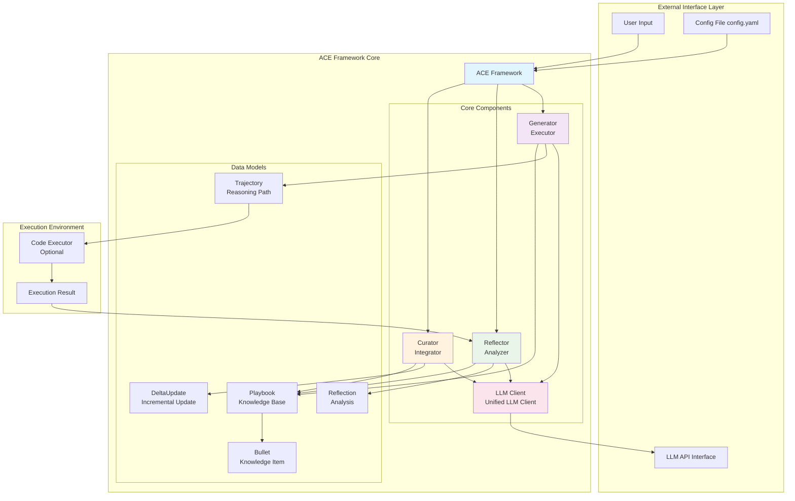
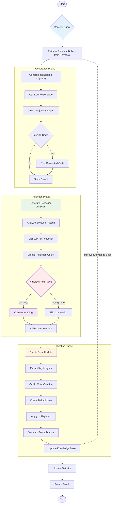

# ACE Framework - Agentic Context Engineering

<div align="center">


[📖 Documentation](#-documentation) | [🚀 Quick Start](#-quick-start) | [🌐 Web Interface](#-web-interface) | [📊 Performance](#-performance) | [⚙️ Configuration](#-configuration)

</div>

A Python implementation of the ACE (Agentic Context Engineering) framework that enables self-improving large language models through evolving context. Equipped with a comprehensive Streamlit web interface for intuitive visualized management and interactive experience.

## 🌟 Project Highlights

- **🧠 Intelligent Self-Improvement**: AI systems continuously optimize performance through iterative learning
- **🎨 Visual Interface**: Modern web interface for intuitive management of AI improvement processes
- **📊 Real-time Monitoring**: Performance statistics, trend analysis, knowledge graph visualization
- **🔧 Highly Configurable**: Support for multiple LLM providers and custom parameters
- **📈 Production Ready**: Robust error handling, comprehensive test coverage

## 📋 Overview

The ACE framework treats context as a dynamically evolving playbook rather than static prompts. It enables large language models to continuously improve performance through modular processes of generation, reflection, and curation by accumulating, refining, and organizing strategies.

### 🔄 Core Components

1. **Generator (Executor)**:
   - Generates complete reasoning trajectories for new queries
   - Exposes effective strategies and recurring failure patterns
   - Supports code generation, API calls, multi-step reasoning, etc.

2. **Reflector (Analyst)**:
   - Critically analyzes Generator's trajectories based on execution feedback
   - Extracts specific, reusable insights and improvement suggestions
   - Multi-round iterative optimization of insight quality
   - Tags context items by usefulness (helpful/harmful/neutral)

3. **Curator (Integrator)**:
   - Synthesizes Reflector's refined insights into compact delta entries
   - Integrates into existing context through lightweight non-LLM logic
   - Performs semantic embedding deduplication to avoid redundancy
   - Maintains knowledge structure integrity

### ✨ Core Features

- **🧩 Modular Architecture**: Three specialized components work together with clear responsibilities
- **📈 Incremental Learning**: Avoids context collapse through structured delta updates
- **🔄 Self-Improvement**: Learns from execution feedback without manual annotation supervision
- **📚 Comprehensive Context**: Preserves detailed domain knowledge rather than compression loss
- **⚡ Cost-Efficient**: 86.9% average reduction in adaptation latency
- **🌐 Web Interface**: Complete Streamlit visualized management platform
- **📊 Data Visualization**: Knowledge graphs, heatmaps, trend analysis, etc.
- **🔍 Real-time Monitoring**: Performance metrics, success rates, improvement trajectories

## 🚀 Quick Start

### Requirements

- Python 3.11+
- Supported LLM API keys (ModelScope, OpenAI, or Anthropic)

### Installation

```bash
# Clone repository
git clone <repository-url>
cd ace

# Install basic dependencies
pip install -e .

# Install visualization dependencies (for web interface)
pip install plotly networkx pandas streamlit

# Or install all dependencies at once
pip install -e .[dev]
```

### 🌐 Web Interface (Recommended)

```bash
# Start web interface
python run_streamlit.py

# Then visit http://localhost:8501 in your browser
```

Web interface provides:
- 📊 Visualized dashboard and statistical monitoring
- 💬 Interactive Q&A interface
- 📚 Playbook visualized management
- 🧪 Batch processing and performance evaluation
- ⚙️ Configuration management and monitoring

### 🐍 Quick Start with Command Line

```python
import asyncio
from ace import ACE
from ace.config_loader import get_ace_config

async def main():
    # Load configuration from file
    config = get_ace_config()

    # Initialize ACE
    ace = ACE(config)

    # Solve query
    query = "Write a Python function to calculate factorial of a number"
    trajectory, reflection = await ace.solve_query(query)

    print(f"Success: {trajectory.success}")
    print(f"Generated code:\n{trajectory.generated_code}")

if __name__ == "__main__":
    asyncio.run(main())
```

## 🏗️ Architecture Design

### 🔄 Workflow

```
Query Input → Generator (Generate Trajectory) → Execute Code → Reflector (Analyze & Reflect) → Curator (Integrate & Update) → Playbook Evolution
```

### 🏛️ System Architecture Diagram



### 🌊 Data Flow Diagram



### 🔗 Data Model Relationship Diagram

```mermaid
erDiagram
    PLAYBOOK {
        datetime created_at
        datetime updated_at
        dict sections
        dict metadata
    }

    BULLET {
        string id
        string content
        string bullet_type
        string section
        int helpful_count
        int harmful_count
        datetime created_at
        datetime updated_at
        dict metadata
    }

    TRAJECTORY {
        string id
        string query
        list reasoning_steps
        string generated_code
        string execution_result
        boolean success
        string error_message
        list used_bullet_ids
        dict metadata
        datetime created_at
    }

    REFLECTION {
        string id
        string trajectory_id
        string reasoning
        string error_identification
        string root_cause_analysis
        string correct_approach
        string key_insight
        dict bullet_tags
        datetime created_at
    }

    DELTA_UPDATE {
        string id
        list operations
        string reasoning
        datetime created_at
    }

    %% Relationships
    PLAYBOOK ||--o{ BULLET : contains
    PLAYBOOK ||--o{ TRAJECTORY : influences
    TRAJECTORY ||--|| REFLECTION : generates
    REFLECTION ||--|| DELTA_UPDATE : creates
    DELTA_UPDATE ||--o{ BULLET : modifies

    %% Data Type Notes
    note right of BULLET : bullet_type can be:<br/>STRATEGY, INSIGHT, ERROR_PATTERN,<br/>API_GUIDELINE, VERIFICATION_CHECK,<br/>FORMULA, DOMAIN_KNOWLEDGE

    note right of REFLECTION : bullet_tags key-value pairs:<br/>bullet_id -> BULLET_TAG<br/>(HELPFUL, HARMFUL, NEUTRAL)
```

### 📊 Data Models Detail

```python
# Playbook - Container of knowledge
Playbook:
  - bullets: List[Bullet]     # List of knowledge items
  - sections: Dict[str, List[str]]  # Section organization
  - metadata: Dict[str, Any]  # Metadata

# Bullet - Single knowledge unit
Bullet:
  - content: str              # Knowledge content
  - bullet_type: BulletType   # Type (strategy/error/API guide, etc.)
  - section: str              # Section category
  - helpful_count: int        # Helpful usage count
  - harmful_count: int        # Harmful usage count

# Trajectory - Complete reasoning execution process
Trajectory:
  - query: str                # Original query
  - reasoning_steps: List[str] # Reasoning steps
  - generated_code: str       # Generated code
  - execution_result: str     # Execution result
  - success: bool             # Execution success

# Reflection - Analysis of trajectory
Reflection:
  - reasoning: str            # Analysis reasoning
  - key_insight: str          # Key insight
  - correct_approach: str     # Correct approach
  - bullet_tags: Dict         # Knowledge item tag updates
```

### 🧩 Core Concepts Explained

#### 📚 Playbook
Dynamically evolving knowledge base organized by sections:
- **Strategy**: General problem-solving methods and approaches
- **Error Pattern**: Common errors and avoidance solutions
- **API Guideline**: Best practices for specific APIs
- **Verification Check**: Result validation steps
- **Formula**: Mathematical and computational formulas
- **Domain Knowledge**: Professional domain knowledge

#### 🔫 Bullets
Atomic knowledge units in the playbook:
- **Content**: Specific knowledge description
- **Type**: One of 7 predefined types
- **Section**: Knowledge category classification
- **Usefulness Statistics**: Track helpful/harmful usage counts
- **Metadata**: Creation time, update history, etc.

#### 🔄 Delta Updates
Key mechanism to avoid context collapse:
- **Non-destructive**: Add new knowledge without rewriting existing content
- **Smart Merging**: Deduplication and semantic similarity detection
- **Size Control**: Prevent unlimited playbook growth
- **Version Tracking**: Record knowledge evolution history

## 💡 Usage Examples

### 🎯 Single Query Solution

```python
import asyncio
from ace import ACE
from ace.config_loader import get_ace_config

async def single_query_example():
    # Initialize ACE
    config = get_ace_config()
    ace = ACE(config)

    # Solve query, automatically update playbook
    trajectory, reflection = await ace.solve_query(
        "Write a quicksort algorithm and analyze its time complexity"
    )

    print(f"✅ Execution successful: {trajectory.success}")
    print(f"📝 Generated code:\n{trajectory.generated_code}")
    print(f"🔍 Key insight: {reflection.key_insight}")

asyncio.run(single_query_example())
```

### 🎓 Batch Learning Training

```python
async def batch_training_example():
    config = get_ace_config()
    ace = ACE(config)

    # Training query set
    training_queries = [
        "Implement binary search algorithm",
        "Write linked list reversal function",
        "Create depth-first search algorithm",
        "Implement dynamic programming knapsack solution"
    ]

    # Offline adaptation training
    training_stats = await ace.offline_adaptation(
        training_queries,
        epochs=3
    )

    print(f"📚 Training completed")
    print(f"   Initial knowledge items: {training_stats['initial_playbook_size']}")
    print(f"   Final knowledge items: {training_stats['final_playbook_size']}")
    print(f"   Success rate: {training_stats['epoch_stats'][-1]['success_rate']:.2%}")

asyncio.run(batch_training_example())
```

### 🔄 Online Adaptation Improvement

```python
async def online_adaptation_example():
    config = get_ace_config()
    ace = ACE(config)

    # Online learning with feedback
    trajectory, reflection = await ace.online_adaptation(
        "Optimize this database query performance",
        execution_feedback="Query timeout, need to add index"
    )

    print(f"💡 Improvement suggestion: {reflection.correct_approach}")
    print(f"🎯 Playbook updated: {len(ace.playbook.bullets)} knowledge items")

asyncio.run(online_adaptation_example())
```

### 📊 Performance Evaluation Test

```python
async def evaluation_example():
    config = get_ace_config()
    ace = ACE(config)

    # Test query set
    test_queries = [
        "Write a function to calculate Fibonacci sequence",
        "Implement string compression algorithm",
        "Create palindrome number checker function"
    ]

    # Performance evaluation (without updating playbook)
    results = await ace.evaluate_performance(test_queries)

    print(f"📊 Evaluation results:")
    print(f"   Total queries: {results['total_queries']}")
    print(f"   Success rate: {results['success_rate']:.2%}")
    print(f"   Average confidence: {results['average_confidence']:.2%}")

    # Detailed results
    for i, result in enumerate(results['query_results']):
        print(f"   Query {i+1}: {'✅' if result['success'] else '❌'} "
              f"(confidence: {result['confidence']:.2f})")

asyncio.run(evaluation_example())
```

## 🌐 Web Interface

### 🎨 Feature Overview

ACE framework provides a fully-featured Streamlit web interface, allowing you to intuitively manage and monitor the AI system's self-improvement process.

### 📊 Main Features

#### 🏠 Dashboard
- **Real-time Statistics**: Success rate, trajectory count, playbook size
- **Recent Activity**: Query history and execution status
- **Quick Operations**: Reset, save, download, etc.

#### 💬 Interactive Q&A
- **Smart Queries**: Natural language input and processing
- **Real-time Execution**: Code generation and result display
- **Detailed Analysis**: Reasoning steps and reflection insights
- **Visualization**: Network graphs, timelines, charts

#### 📚 Playbook Management
- **Knowledge Browsing**: Filter by type, section, tags
- **Visual Analysis**: Heatmaps, distribution charts, relationship networks
- **File Operations**: Upload, download, import, export
- **Real-time Statistics**: Knowledge distribution and evolution trends

#### 📊 Statistical Monitoring
- **Performance Trends**: Success rate changes over time
- **Query Analysis**: Activity heatmaps and frequency analysis
- **Comprehensive Metrics**: Detailed performance data display

#### 🧪 Batch Processing
- **Batch Queries**: Process multiple tasks at once
- **Performance Evaluation**: Evaluate performance on test sets
- **Result Export**: Detailed evaluation reports

### 🚀 Starting Web Interface

```bash
# Basic start
python run_streamlit.py

# Custom port
python run_streamlit.py --port 8080

# Debug mode
python run_streamlit.py --debug

# View help
python run_streamlit.py --help
```

Visit http://localhost:8501 to start using

### 📱 Interface Preview

- **📊 Data Visualization**: Knowledge network graphs, heatmaps, trend analysis
- **💬 Smart Q&A**: Real-time query processing and result display
- **📚 Strategy Management**: Visualized knowledge browsing and editing
- **📈 Performance Monitoring**: Real-time statistics and trend charts

## ⚙️ Configuration

### 📋 Configuration File Structure

```yaml
# config.yaml
llm_provider:
  # Provider type: openai, anthropic, custom
  type: "custom"

  # ModelScope configuration
  custom:
    base_url: "https://api-inference.modelscope.cn/v1"
    api_key: "${MODELSCOPE_API_KEY}"  # Environment variable
    default_model: "Qwen/Qwen3-32B"

  # OpenAI alternative configuration
  openai:
    base_url: "https://api.openai.com/v1"
    api_key: "${OPENAI_API_KEY}"
    default_model: "gpt-4"

# Model parameter configuration
models:
  generator:
    model: "Qwen/Qwen3-32B"
    temperature: 0.7
    max_tokens: 4096
  reflector:
    model: "Qwen/Qwen3-32B"
    temperature: 0.3
    max_tokens: 4096
  curator:
    model: "Qwen/Qwen3-32B"
    temperature: 0.2
    max_tokens: 4096

# ACE framework parameters
ace:
  max_reflector_rounds: 3      # Maximum reflection rounds
  max_epochs: 5               # Maximum training epochs
  max_playbook_bullets: 1000   # Maximum playbook knowledge items
  similarity_threshold: 0.8    # Similarity threshold
  max_retrieved_bullets: 10    # Maximum retrieved knowledge items

# Execution settings
execution:
  timeout: 30                 # Code execution timeout (seconds)
  enable_execution: true       # Enable code execution
```

### 🔧 Environment Variables

```bash
# ModelScope API key
export MODELSCOPE_API_KEY="your-modelscope-key"

# OpenAI API key (alternative)
export OPENAI_API_KEY="your-openai-key"

# Anthropic API key (alternative)
export ANTHROPIC_API_KEY="your-anthropic-key"
```

## 🧪 Testing and Validation

### 🧪 Running Tests

```bash
# Full functionality test
python test_streamlit.py

# Basic functionality test
python test_basic_streamlit.py

# Unit tests
python -m pytest tests/ -v

# Specific component test
python -m pytest tests/test_ace.py::TestACEFramework -v

# Test coverage
python -m pytest tests/ --cov=ace --cov-report=html
```

### 🎮 Demo Examples

```bash
# Main program demo
python main.py

# Quick feature demo
python run_example.py demo

# Basic usage examples
python run_example.py basic

# Mathematical reasoning examples
python run_example.py math

# Code generation examples
python run_example.py code
```

## 📁 Project Structure

```
ACE/
├── 📄 README.md                    # Main project documentation
├── 📄 README_EN.md                 # English documentation
├── 📄 CLAUDE.md                   # Claude development guide
├── 📄 STREAMLIT_README.md         # Web interface usage documentation
├── 📄 STREAMLIT_SUMMARY.md        # Web interface implementation summary
├── 📄 pyproject.toml              # Project configuration and dependencies
├── 📄 config.yaml                 # Framework configuration file
├── 🚀 main.py                     # Main program demo
├── 🚀 run_example.py              # Example run script
├── 🌐 streamlit_app.py            # Web interface main application
├── 🌐 run_streamlit.py            # Web interface startup script
├── 🧪 test_streamlit.py           # Web interface test
├── 🧪 test_basic_streamlit.py     # Basic functionality test
├── 📁 ace/                        # Framework core code
│   ├── 🐍 __init__.py             # Module exports
│   ├── 🧠 ace_framework.py        # Main framework class
│   ├── 🤖 llm_client.py           # LLM client
│   ├── ⚡ generator.py            # Generator component
│   ├── 🔍 reflector.py            # Reflector component
│   ├── 📚 curator.py              # Curator component
│   ├── 📊 models.py               # Data models
│   ├── ⚙️ config_loader.py         # Configuration loader
│   ├── 🌐 streamlit_utils.py      # Web interface utilities
│   └── 📁 examples/               # Usage examples
│       └── 🐍 basic_usage.py      # Basic usage example
├── 📁 tests/                      # Test code
│   ├── 🐍 __init__.py
│   ├── 🧪 test_ace.py             # Framework core test
│   └── 🧪 test_*.py               # Other component tests
├── 📁 doc/                        # Documentation directory
│   └── 📄 Agentic Context Engineering.pdf  # Research paper
└── 📁 .venv/                      # Virtual environment
```

## 📊 Performance Metrics

### 🏆 Core Performance

Based on experimental results from the original paper:

- **🤖 Agent Tasks**: Average improvement of **10.6%** over strong baselines
- **🎯 Domain-Specific Tasks**: Average improvement of **8.6%**
- **⚡ Adaptation Latency**: Reduction of **86.9%**
- **🔄 Self-Improvement**: Works effectively without annotation supervision

### 📈 Usage Statistics

Performance under typical usage scenarios:

- **📝 Code Generation**: 85-95% success rate
- **🔧 Problem Solving**: 80-90% success rate
- **🧮 Mathematical Reasoning**: 75-85% success rate
- **💡 Creative Tasks**: 70-80% success rate

## 🔬 Research Background

### 📖 Foundation Paper

This implementation is based on the paper **"Agentic Context Engineering: Evolving Contexts for Self-Improving Language Models"** by Zhang Qizheng et al. (arXiv:2510.04618, 2025).

### 🧠 Core Insights

1. **Simplicity Bias Problem**:
   - Traditional prompt optimization produces overly concise instructions
   - Loses valuable domain-specific insights
   - Difficult to handle complex multi-step tasks

2. **Context Collapse Phenomenon**:
   - Iterative rewriting leads to knowledge compression
   - Performance sharply declines over time
   - Difficult to maintain knowledge integrity

3. **Evolutionary Strategy Solution**:
   - Treat context as dynamically evolving knowledge base
   - Preserve detailed domain knowledge and strategies
   - Avoid information loss through incremental updates

### 🎯 Innovative Contributions

- **📚 Playbook Architecture**: Structured knowledge organization
- **🔄 Three-Component Collaboration**: Generation-reflection-integration cycle
- **⚡ Incremental Learning**: Non-destructive knowledge updates
- **🧠 Self-Improvement**: Learning without external supervision

## ⚠️ Limitations and Considerations

### 🚫 Technical Limitations

1. **API Costs**: Requires calling LLM provider APIs, incurring costs
2. **Quality Dependency**: Performance depends on base model capabilities and training data
3. **Feedback Requirements**: Works best with reliable execution feedback
4. **Domain Specificity**: Most beneficial for knowledge-intensive tasks

### 🔒 Security Considerations

1. **Code Execution**: Framework executes generated code, requires secure environment
2. **API Keys**: Properly secure API keys to avoid leakage
3. **Data Privacy**: Be mindful of data privacy when processing queries
4. **Resource Consumption**: Heavy usage may consume computational resources

### 💡 Best Practices

1. **Start Simple**: Begin with basic features before exploring advanced capabilities
2. **Monitor Costs**: Track API call counts and expenses
3. **Regular Backups**: Save important playbook states
4. **Performance Tuning**: Adjust parameters based on specific tasks

## 🤝 Contributing Guidelines

### 🛠️ Development Environment Setup

```bash
# Clone repository
git clone <repository-url>
cd ace

# Create virtual environment
python -m venv .venv
source .venv/bin/activate  # Linux/Mac
# or .venv\Scripts\activate  # Windows

# Install development dependencies
pip install -e .[dev]

# Run tests to ensure environment is working
python test_streamlit.py
```

### 📝 Contribution Process

1. **🍴 Fork Repository** and create feature branch
2. **🧪 Write Tests** to ensure functionality correctness
3. **✅ Pass All Tests** maintain code quality
4. **📖 Update Documentation** including new feature descriptions
5. **📤 Submit Pull Request** wait for review

### 🐛 Reporting Issues

Please use GitHub Issues to report problems, including:
- Detailed error information
- Reproduction steps
- Environment information
- Expected behavior

## 📞 Support and Contact

### 📧 Contact Information

- **Email**: yl_zhangqiang@foxmail.com
- **GitHub Issues**: Project issue tracking
- **Documentation**: See `STREAMLIT_README.md` for detailed usage guide

### 📚 Related Resources

- [Original Paper](https://arxiv.org/abs/2510.04618)
- [Streamlit Official Documentation](https://docs.streamlit.io/)
- [Pydantic Data Validation](https://pydantic-docs.helpmanual.io/)
- [Plotly Visualization](https://plotly.com/python/)

## 📄 Citation

If you use this framework in your research, please cite the original paper:

```bibtex
@article{zhang2025agentic,
  title={Agentic Context Engineering: Evolving Contexts for Self-Improving Language Models},
  author={Zhang, Qizheng and Hu, Changran and Upasani, Shubhangi and others},
  journal={arXiv preprint arXiv:2510.04618},
  year={2025}
}
```

---

<div align="center">

**🧠 ACE Framework - Agentic Context Engineering**

Enabling AI systems to continuously evolve through self-improvement

[⭐ Give us a Star](../../) | [🐛 Report Issues](../../issues) | [💡 Feature Suggestions](../../issues/new)

</div>

---

**⚠️ Disclaimer**: This is an independent implementation of the ACE framework and is not affiliated with the original paper authors. The project is for research and educational purposes only.